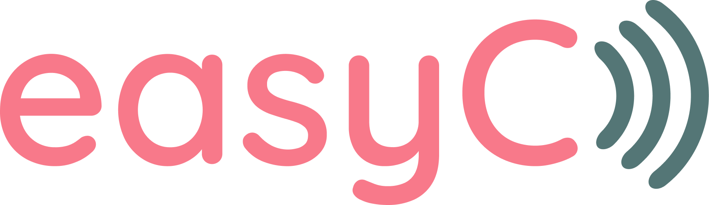
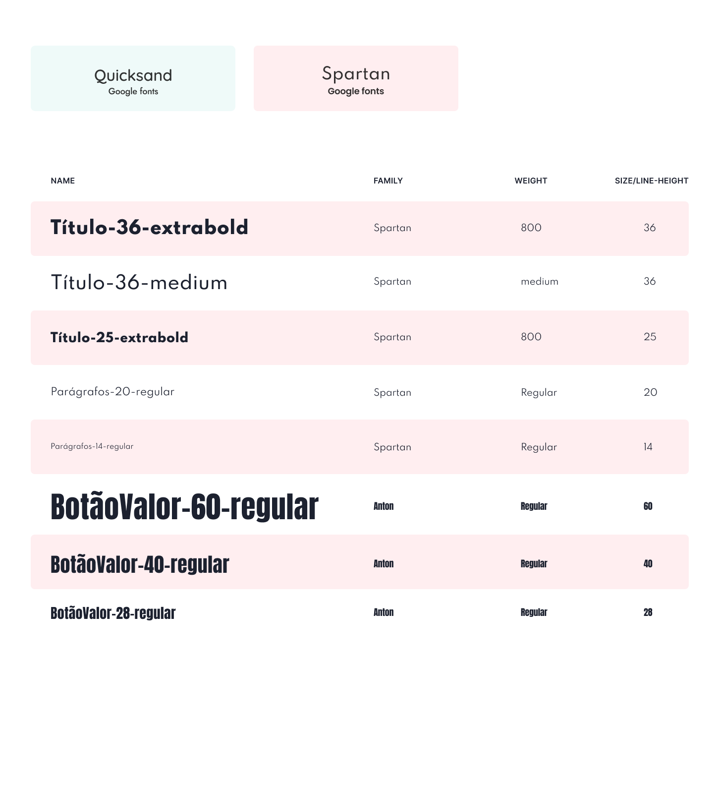
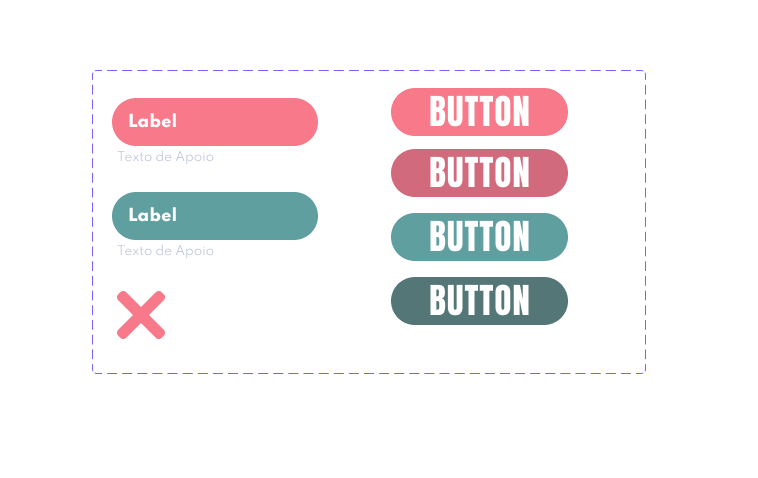
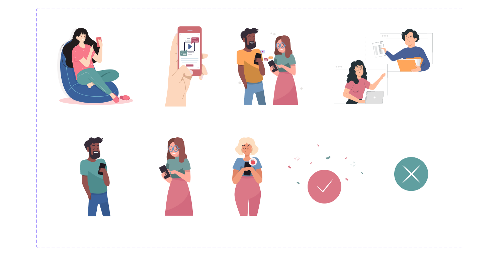

# PROJETO FIM DE CURSO RESILIA + M4U

    

 

A **easyC** é um projeto de fim de curso do **Bootcamp de Desenvolvimento Web Full-Stack** da **Resilia Educação** em parceria com a empresa de tecnologia **M4U**.

Nosso desafio foi criar uma plataforma de recarga de celular e compra de chip virtual.

Ficou a nossa escolha criar a plataforma em cima de alguma operadora existente no mercado ou criar uma fictícia. Dessa forma optamos por criar a nossa própria, assim podíamos desenvolver também a nossa criatividade ao invés de ficarmos presos a algo existente.
 
 

## 🚀 Começando

Essas instruções permitirão que você consiga ter esse projeto em operação na sua máquina local para fins de desenvolvimento e teste.

### 📋 Pré-requisitos para instalação 🔧

* Instale NodeJS em seu computador.
* Baixe os aquivos do repositório M4U-Project aqui no GitHub.
* Entre na pasta Source e digite no terminal o comando: npm install, em seguida digite: npm start.

 
 

## 📦 Desenvolvimento

### 🛠️ Construído com

* [Figma](https://www.figma.com/) - Design UX-UI.
* [Trello](https://trello.com/) - Gestão de Projetos.
* [NodeJS](https://nodejs.org/pt-br/docs/) - Framework utilizado no Back-end.
* [JavaScript](https://developer.mozilla.org/pt-BR/docs/Web/JavaScript) - Linguagem utilizada no Front-end.
* [HTML](https://developer.mozilla.org/pt-BR/docs/Web/HTML) - Linguagem de marcação utilizada no Front-end.
* [CSS](https://developer.mozilla.org/pt-BR/docs/Web/CSS) - Utilizado para estilização das páginas no Front-end.
* [MySQL](https://dev.mysql.com/doc/) - Gerenciador de Banco de dados.
* [Heroku](https://www.heroku.com/) - Deploy do banco de dados.
 

## 📌 Versão

Nós usamos [GitHub](https://github.com/) para controle de versão. Para as versões disponíveis, procure em [M4U-Project](https://github.com/wevertonbezzera013/M4U-Project).
 
 

## ✏️ Produto | Processo Criativo

### 🏷️ Branding

    

 

    

 

    

 

    

 

### 💻 Sitemap

    

 

## ✒️ Desenvolvedores

💻**Bruno Tadeu** - *Back-end / Data* - [GitHub](https://github.com/brunotad) - [Linkedin](https://www.linkedin.com/in/brunotad/)

💻 **João Pedro** - *Back-end / Data* - [GitHub](https://github.com/JoaoLopes994) - [Linkedin](https://www.linkedin.com/in/jplopessilva/)

💻**Juliete Freitas** - *FullStack* - [GitHub](https://github.com/julietefreitas) - [Linkedin](https://www.linkedin.com/in/juliete-freitas/)

💻 **Samantha Bianchi** - *Desing / Front-end* - [GitHub](https://github.com/SahBianchi) - [Linkedin](https://www.linkedin.com/in/sahbianchi/)

💻 **Weverton Bezerra** - *Front-end* - [GitHub](https://github.com/wevertonbezzera013) - [Linkedin](https://www.linkedin.com/in/weverton-bezerra-da-costa-061ab11a4/)

 

## 🎁 Expressões de gratidão

* Gostariámos de agradecer a Resilia + M4U por promover esse desafio de fim de curso, onde pudemos ter a oportunidade de estar em contato com uma grande empresa do segmento de telecom e pagamentos, e assim poder desenvolver uma aplicação utilizando todas as habilidades aprendidas no decorrer do Bootcamp.

* Obrigada à todas as pessoas da equipe da M4U que estiveram presentes conosco durante essa jornada e por todos os ensinamentos passados. Foi de grande ajuda para o desenvolvimento desse projeto e na nossa formação. 💪
 
